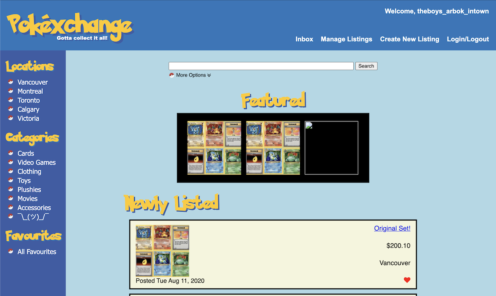
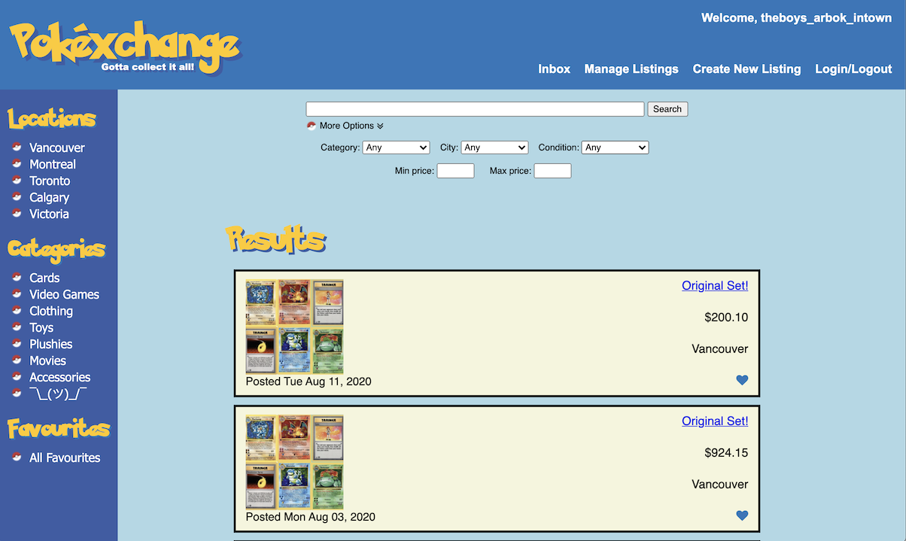
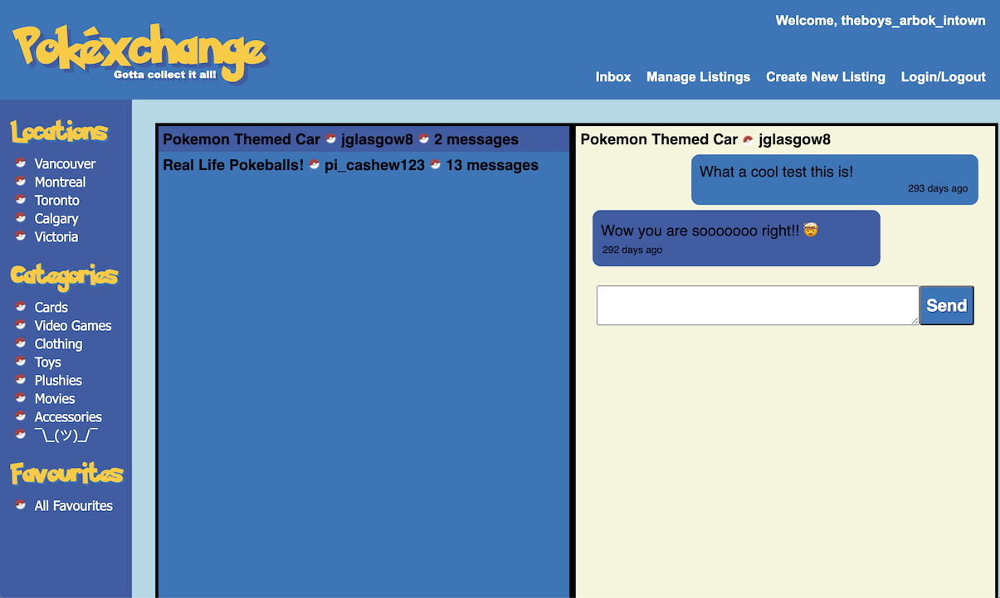
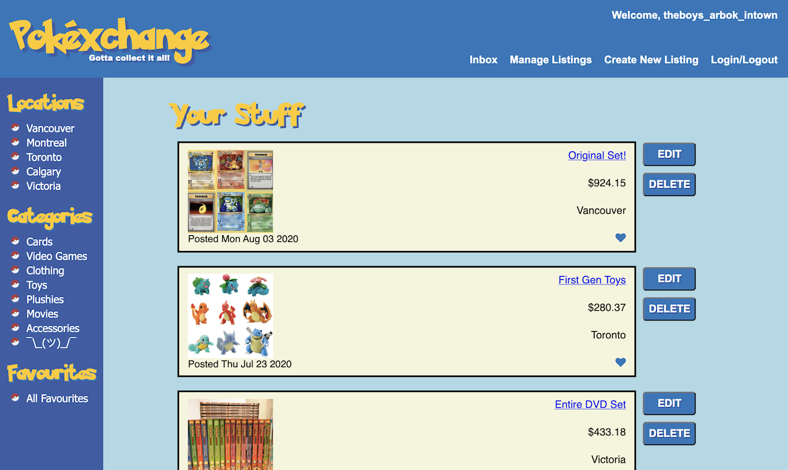
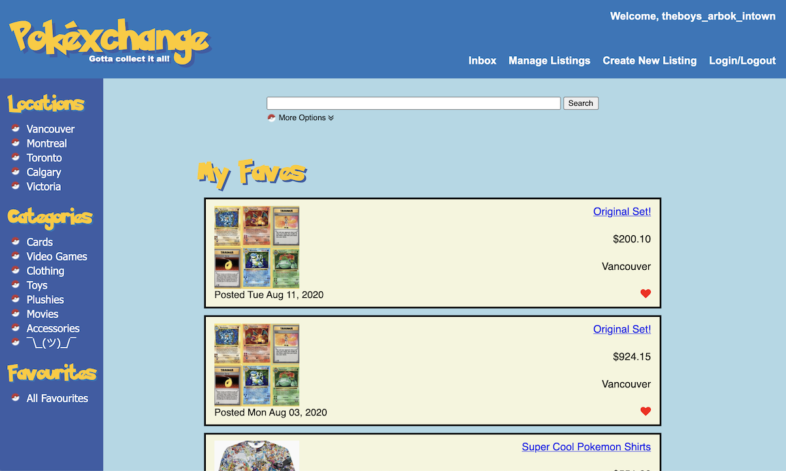

# Pokéxchange: Lighthouse Labs Midterm Project

A buy/sell app for Pokémon collectibles, memorabilia, and more! Created with a retro theme to suit the content, this app allows users to easily search by location or category in the nav bar, or to do a more refined custom search from within the page. Users can contact other users regarding their postings as well as receive and respond to incoming messages, create and edit listings for their own items, and add other users' listings to a personal favourites list.

## Final Product

## Getting Started

1. Fork this repository, then clone your fork of this repository.
1. Create an `.env` file with relevant database information filled in as noted in `.env.example`.
1. Install dependencies using the `npm install` command.
1. Start the web server using the `npm run local` command. The app will be served at <http://localhost:8080/>.
1. Go to <http://localhost:8080/> in your browser.

## Dependencies

- Node 10.x or above
- NPM 5.x or above
- PG 6.x
